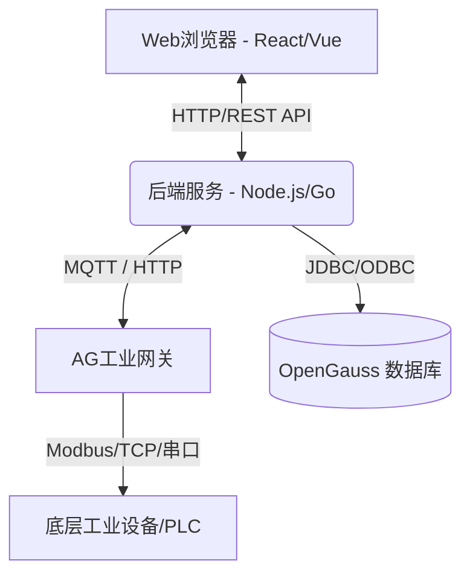

# 技术架构文档 (Tech Arch) - AG网关数据采集系统

## 1. 系统架构概览

### 1.1 总体架构图
本系统采用前后端分离的 B/S 架构，后端作为控制平面及数据接收节点，与边缘侧“AG网关”进行配置下发与数据接收，最终持久化至 OpenGauss 数据库。



### 1.2 技术栈选型
- **前端**：React 或 Vue.js (用于提供友好的配置界面)。
- **后端**：Go 或 Node.js (处理高并发连接、报文解析与RESTful API提供)。
- **数据库**：**OpenGauss** (关系型数据库，用于存储设备配置、点位映射关系以及高频V3/V4时序数据)。
- **通信协议**：RESTful API (Web端配置交互), MQTT/HTTP Webhook (网关数据转发), TCP/UDP直连 (本地配置代理)。

## 2. 系统核心模块设计

### 2.1 网关通信服务
- **数据接收引擎 (Data Ingestion)**：
  - 提供 HTTP Webhook 或 MQTT 订阅，接收 V3/V4 报文。
  - **V3报文解析**：解析 `sncode`, `time`，遍历 `dev` 对象下的实例，提取 `pn`, `q`, `v`。
  - **V4报文解析**：处理结构一致，根据 `dev` 对象下具体的设备编号解析。
- **配置下发服务 (Config Delivery)**：
  - 基于网关的配置接口（本地或远程），将点位、报警规则、定时任务转换为网关可识别的格式下发（即模拟AgConfig的“下载配置”动作）。

### 2.2 核心实体定义
1. **Gateway (网关)**：具有唯一的 `sncode`，并包含IP、状态、别名等属性。
2. **Device/Channel (设备/通道)**：网关下的具体采集通道（如RS485, TCP连接）。
3. **Data Point (点位)**：采集标签，包含名称、类型(IO/Memory)、上传规则等。
4. **Alarm Rule (报警规则)**：与特定点位绑定，设置高低阈值及抗干扰机制。
5. **Telemetry (遥测数据)**：由网关上传的时序数据记录。

## 3. OpenGauss 数据库设计

### 3.1 核心表结构 (DDL 概览)

**1. 网关基础信息表 (`gateway_info`)**
```sql
CREATE TABLE gateway_info (
    sncode VARCHAR(64) PRIMARY KEY,
    alias VARCHAR(128),
    ip_address VARCHAR(64),
    mac_address VARCHAR(64),
    firmware_version VARCHAR(32),
    remote_enabled BOOLEAN DEFAULT FALSE,
    connection_password VARCHAR(128),
    status VARCHAR(16) DEFAULT 'OFFLINE',
    created_at TIMESTAMP DEFAULT CURRENT_TIMESTAMP,
    updated_at TIMESTAMP DEFAULT CURRENT_TIMESTAMP
);
```

**2. 设备通道表 (`devices`)**
```sql
CREATE TABLE devices (
    id SERIAL PRIMARY KEY,
    gateway_sncode VARCHAR(64) REFERENCES gateway_info(sncode) ON DELETE CASCADE,
    device_code VARCHAR(64) NOT NULL, -- 对应V3/V4报文中的实例名称/设备编号 (如 693e75ec)
    device_name VARCHAR(128),
    protocol_type VARCHAR(32), -- Modbus, IEC104等
    created_at TIMESTAMP DEFAULT CURRENT_TIMESTAMP,
    UNIQUE(gateway_sncode, device_code)
);
```

**3. 采集点位表 (`data_points`)**
```sql
CREATE TABLE data_points (
    id SERIAL PRIMARY KEY,
    device_id INT REFERENCES devices(id) ON DELETE CASCADE,
    point_name VARCHAR(64) NOT NULL, -- 对应报文中的 pn
    point_type VARCHAR(16) DEFAULT 'IO', -- IO or Memory
    upload_strategy VARCHAR(32), -- 周期上传, 变化上传, 立即上传, 不上传
    data_type VARCHAR(16), -- Int, Float, Bool, String
    created_at TIMESTAMP DEFAULT CURRENT_TIMESTAMP
);
```

**4. 报警规则表 (`alarm_rules`)**
```sql
CREATE TABLE alarm_rules (
    id SERIAL PRIMARY KEY,
    point_id INT REFERENCES data_points(id) ON DELETE CASCADE,
    is_enabled BOOLEAN DEFAULT FALSE,
    hh_limit NUMERIC,
    h_limit NUMERIC,
    l_limit NUMERIC,
    ll_limit NUMERIC,
    deadband NUMERIC DEFAULT 0,
    sustain_time INT DEFAULT 0,
    recovery_time INT DEFAULT 0,
    hh_msg VARCHAR(255),
    h_msg VARCHAR(255),
    l_msg VARCHAR(255),
    ll_msg VARCHAR(255)
);
```

**5. 历史遥测数据表 (`telemetry_data`)**
*(注：对于 OpenGauss，可以利用分区表特性按时间分区以应对海量时序数据)*
```sql
CREATE TABLE telemetry_data (
    id BIGSERIAL PRIMARY KEY,
    gateway_sncode VARCHAR(64) NOT NULL,
    device_code VARCHAR(64) NOT NULL,
    point_name VARCHAR(64) NOT NULL,
    quality INT NOT NULL, -- 1 为有效
    value VARCHAR(255) NOT NULL,
    ts TIMESTAMP NOT NULL -- 取自报文的 time 字段
);
CREATE INDEX idx_telemetry_ts ON telemetry_data(ts);
CREATE INDEX idx_telemetry_point ON telemetry_data(gateway_sncode, device_code, point_name);
```

### 3.2 报文入库逻辑
当接收到 V3/V4 数据推送报文时，系统执行以下逻辑：
1. 提取顶层 `time` 和 `sncode`。
2. 遍历 `dev` 字典。Key 为 `device_code`（实例名称/设备编号）。
3. 遍历 Value 数组，提取每一项的 `pn` (点位名称), `q` (质量), `v` (数值)。
4. 如果 `q == 1`，将记录转化为 `(sncode, device_code, pn, q, v, time)` 插入至 `telemetry_data` 表中。

## 4. 接口设计概览 (RESTful API)

- `GET /api/v1/gateways` - 获取网关列表及运行状态
- `POST /api/v1/gateways/{sncode}/connect` - 远程/本地连接认证
- `GET /api/v1/gateways/{sncode}/overview` - 获取信息总览(CPU,内存,点位数量等)
- `POST /api/v1/gateways/{sncode}/points/import` - 批量导入点位模板
- `PUT /api/v1/gateways/{sncode}/sync` - 触发“下载配置”，将OpenGauss中的配置推向网关
- `GET /api/v1/telemetry?sncode=...&start=...&end=...` - 查询历史数据用于图表展示
